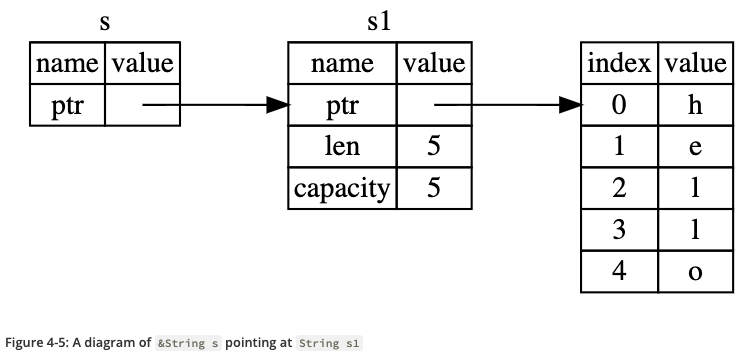

# Rust Programming Language

Learning ["Rust Programming Language"](https://doc.rust-lang.org/book/)

## Work Summary

| Chapter                                                            |    Date    | Comment |
| ------------------------------------------------------------------ | :--------: | ------- |
| CH01 - Getting Started                                             | 2019/08/02 |         |
| CH02 - Programming a Guessing Game                                 | 2019/08/02 |         |
| CH03 - Common Programming Language                                 | 2019/08/03 |         |
| CH04 - Understanding Ownership                                     |     -      |         |
| CH04-01 - What is Ownership?                                       | 2019/08/03 |         |
| CH04-02 - References and Borrowing                                 | 2019/08/03 |         |
| CH04-03 - The Slice Type                                           | 2019/08/03 |         |
| CH05 - Using Structs to Structure Related Data                     | 2019/08/dd |         |
| CH06 - Enums and Pattern Matching                                  | 2019/08/dd |         |
| CH07 - Managing Growing Projects with Packages, Crates and Modules | 2019/08/dd |         |
| CH08 - Common Collections                                          | 2019/08/dd |         |
| CH09 - Error Handling                                              | 2019/08/dd |         |
| CH10 - Generic Types, Traits, and Lifetimes                        | 2019/08/dd |         |
| CH11 - Writing Automated Tests                                     | 2019/08/dd |         |

## Notes

### CH04-02: References

```rust
fn main() {
    let s1 = String::from("hello");
    let len = calculate_length(&s1);
    println!("The length of '{}' is {}.", s1, len);
}

fn calculate_length(s: &String) -> usize {
    s.len()
}
```



### CH04-03: Slices

```rust
fn main() {
    let s = String::from("hello wolrd");
    let hello = &s[..5];
    let world = &s[6..];
}
```


